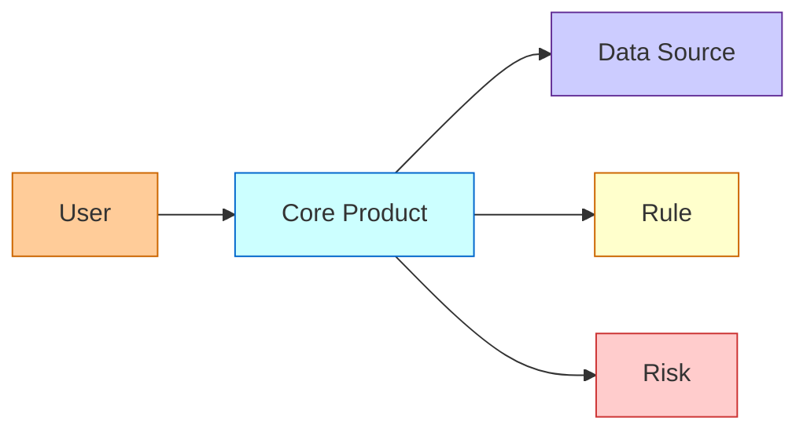
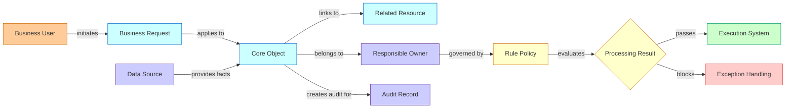
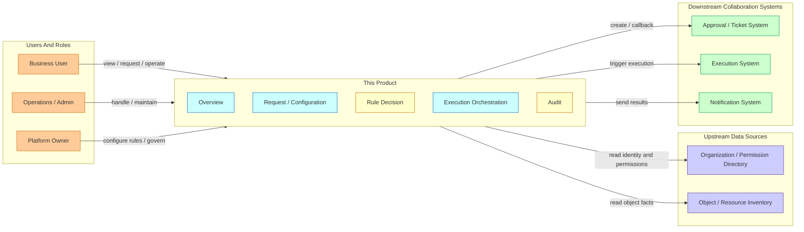
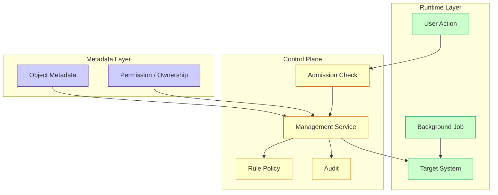
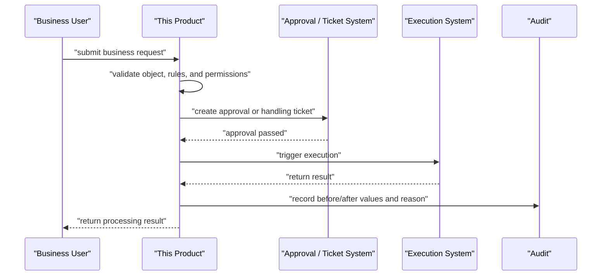
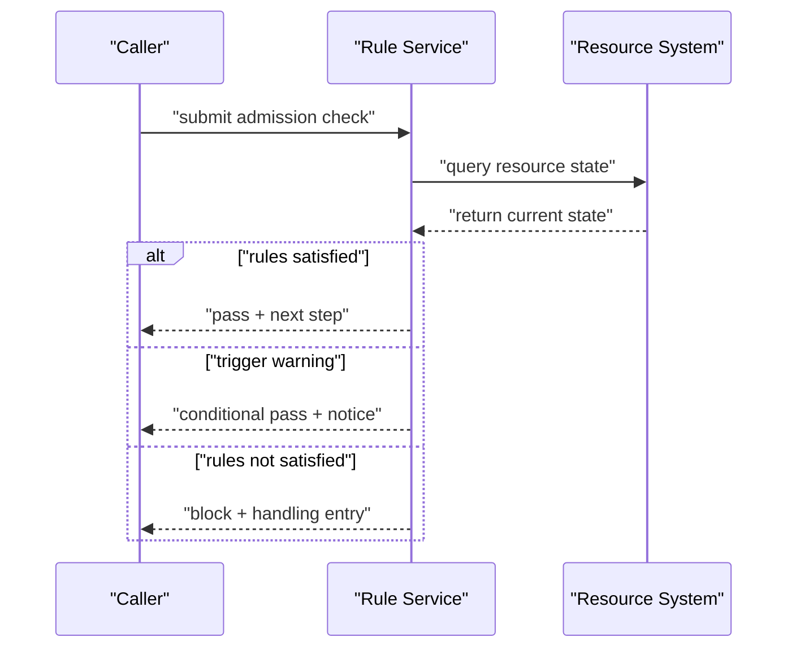
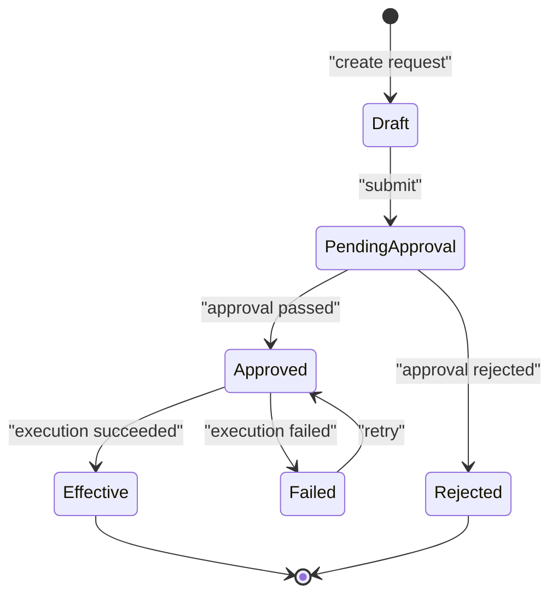
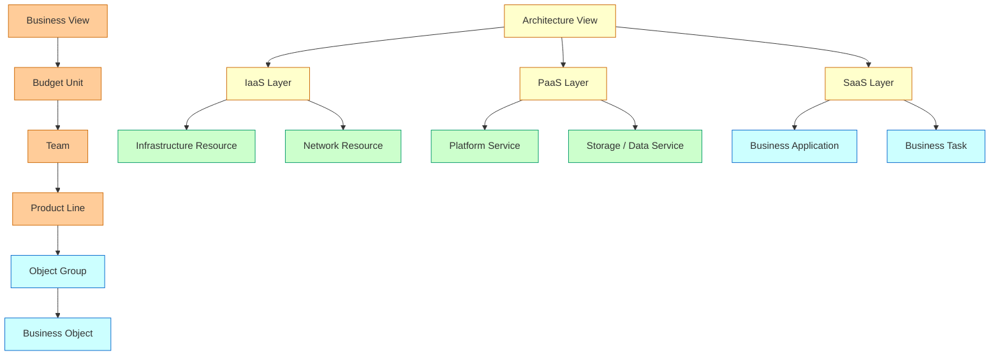
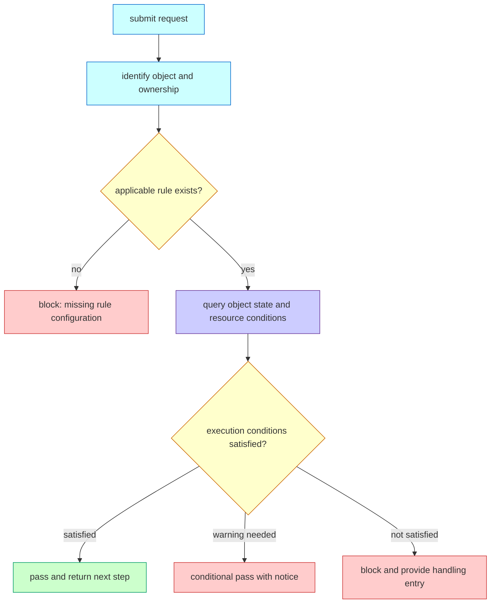

# Mermaid Diagram Patterns For Junco PRDs

Use diagrams to express concept relationships, system boundaries, flows, and rules. The goal is not decoration. A diagram should reduce ambiguity faster than prose.

Use the expression priority: diagrams over tables, tables over prose.

1. Use diagrams for relationships, ownership, system boundaries, layers, lifecycle, decisions, and flows.
2. Use tables for fields, permissions, validations, rule rows, priorities, milestones, and acceptance criteria.
3. Use prose for rationale, tradeoffs, context, exception explanation, and conclusions.

If a table is mainly describing "who relates to whom" or "what happens next", convert it to a diagram. If prose is mainly listing repeated rows, convert it to a table.

## Web-Safe Palette

Use web-safe colors when styling Mermaid diagrams. Keep color usage semantic and restrained. For generated PRDs, web-safe styling is mandatory for `graph`, `flowchart`, and `stateDiagram` diagrams. Use color to encode meaning, not decoration.

| Class | Use | Fill | Stroke | Text |
| --- | --- | --- | --- | --- |
| `actor` | Users, teams, roles | `#FFCC99` | `#CC6600` | `#333333` |
| `core` | Core product concepts | `#CCFFFF` | `#0066CC` | `#333333` |
| `runtime` | Runtime services or active execution | `#CCFFCC` | `#009966` | `#333333` |
| `control` | Rules, approvals, control plane | `#FFFFCC` | `#CC6600` | `#333333` |
| `data` | Metadata, source of truth, records | `#CCCCFF` | `#663399` | `#333333` |
| `risk` | Failure, block, alert, deletion, danger | `#FFCCCC` | `#CC3333` | `#333333` |
| `neutral` | External or reference-only nodes | `#FFFFFF` | `#999999` | `#333333` |

Recommended class definitions:



## Diagram Selection

| Need | Use | Answers |
| --- | --- | --- |
| Clarify core nouns and relationships | `graph LR` concept relationship diagram | What concepts exist? Who owns what? What maps to what? |
| Explain product position in a larger system | `graph LR` system boundary diagram | What does this product own, reuse, or call? |
| Explain layered platform design | `graph TD` or `graph LR` layered architecture | What belongs to metadata, control plane, runtime, delivery? |
| Explain time-ordered interactions | `sequenceDiagram` | Who calls whom, in what order, and where are writes/reads? |
| Explain user or system decision flow | `flowchart TD` | What happens next under each condition? |
| Explain lifecycle and allowed operations | `stateDiagram-v2` | What states exist and which actions move between them? |
| Explain entities, keys, and cardinality | `erDiagram` | What are the entities and relationship cardinalities? |
| Explain business / architecture view tree | `graph TD` | How does the user navigate from high-level business to resources? |

## Rendering Compatibility

Mermaid source is not the same as a rendered preview. Many model tools preserve the fenced code block but do not render it inline. The PRD should remain reviewable in both cases.

- Always use a fenced code block with the language tag `mermaid`.
- Do not state that a visual preview has been generated unless the current environment actually renders, embeds, or attaches one.
- When preview support is unknown, add `Diagram Quick Read` after each non-trivial diagram.
- Keep `Diagram Quick Read` short: 3-5 bullets covering diagram purpose, main path, critical branch/exception, and ownership or source-of-truth boundary.
- If a sequence diagram is used, `Diagram Quick Read` is required because sequence diagrams usually have limited styling and are harder to scan as source.
- If rendering tools are available and the user explicitly needs a visual preview, generate SVG/PNG from the Mermaid source and include it with the source code.
- Prefer renderer-stable syntax for cross-tool documents: `graph`, `flowchart`, `sequenceDiagram`, `stateDiagram-v2`, and `erDiagram`. Avoid experimental Mermaid syntax, raw HTML labels, emoji-only nodes, and complex init directives.

Recommended text fallback:

```markdown
Diagram Quick Read:
- Purpose: state [the question answered by this diagram].
- Main path: [Role/System A] -> [Product Capability] -> [Result].
- Key branches: explain how pass, failure, and exception paths close.
- Responsibility boundary: identify which system or role owns facts, rules, execution, or audit.
```

## Mermaid Rules

- Prefer one clear diagram per question. Do not put every detail into one huge diagram.
- Avoid toy diagrams. A core PRD diagram should usually contain 8-14 meaningful nodes and cover at least three semantic classes such as actor, core, data, control, runtime, and risk.
- Keep diagrams concise. Split into multiple diagrams when relationships, flow, and state compete for space, or when a graph grows beyond roughly 16 meaningful nodes.
- Keep the visual layout tidy: use one dominant direction, group related nodes with `subgraph`, avoid long crossing arrows, and keep labels similar in length.
- Keep node labels business-readable. Use product nouns, not implementation-only variable names unless the PRD is API-facing.
- Quote labels with spaces or punctuation: `A["Business Object"]`.
- Label edges with verbs: `-- "request" -->`, `-- "belongs to" -->`, `-- "calls" -->`.
- Separate management-side concepts from runtime-side concepts.
- Use subgraphs for layers, ownership boundaries, or systems.
- Add a short paragraph before each diagram explaining what the reader should learn.
- Add `Diagram Quick Read` after important diagrams when the PRD may be read in tools that do not render Mermaid.
- Add tables after diagrams for fields, permissions, validations, and exceptions.
- For `graph`, `flowchart`, and `stateDiagram`, always add `classDef` and `class` statements from the web-safe palette. Do not output default monochrome diagrams.
- For `sequenceDiagram` and `erDiagram`, use clear participant/entity grouping; if renderer styling is limited, pair the sequence or ERD with a colored concept, boundary, or decision diagram when color semantics matter.
- Never leave a diagram placeholder. If the PRD says "relationship is shown below", include the Mermaid diagram immediately below it.

## Pattern 1: Concept Relationship Diagram

Use this after concept definitions and before detailed functions. It should make the domain model visible.



When adapting:

- Replace nouns with the real product concepts.
- Show ownership and source-of-truth relationships.
- Show runtime relationships separately from management relationships when they differ.

## Pattern 2: System Boundary Diagram

Use this when a PRD depends on multiple systems or needs to clarify what the product owns.



## Pattern 3: Layered Architecture Diagram

Use this for platform products, especially when separating metadata, control, and runtime.



Good layered diagrams show why a concept belongs in a layer. If a node could sit in two layers, clarify ownership in text.

## Pattern 4: Sequence Diagram

Use this for write paths, read paths, approval paths, task submission, config publish, or any flow where order matters.



Use `alt` for branching:



## Pattern 5: State Machine

Use this when actions depend on status. PRD text should map each state to visible operations.



After the diagram, add an operations table:

| State | Visible Actions | Hidden Actions | Audit |
| --- | --- | --- | --- |
| PendingApproval | Cancel / View | BPM callback | yes |

## Pattern 6: Business View And Architecture View Tree

Use this when the same objects need to support different mental models, such as business ownership, operational responsibility, architecture hierarchy, or resource topology.



Use a view tree when the same data needs to support different mental models.

## Pattern 7: Core Decision Flow

Use this for validations, admission checks, approval decisions, fallback logic, or rule matching.



## PRD Diagram Checklist

For complex PRDs, include at least:

- One concept relationship diagram.
- One system boundary or layered architecture diagram.
- One sequence or flowchart for the core path.
- One state machine if there is lifecycle or workflow state.
- One source-of-truth / data flow diagram if multiple systems write or read the same domain data.

Avoid:

- Diagrams that duplicate tables without adding relationships.
- Mixing user journey, data flow, state machine, and architecture into one unreadable graph.
- Unlabeled arrows.
- Missing ownership boundaries.
