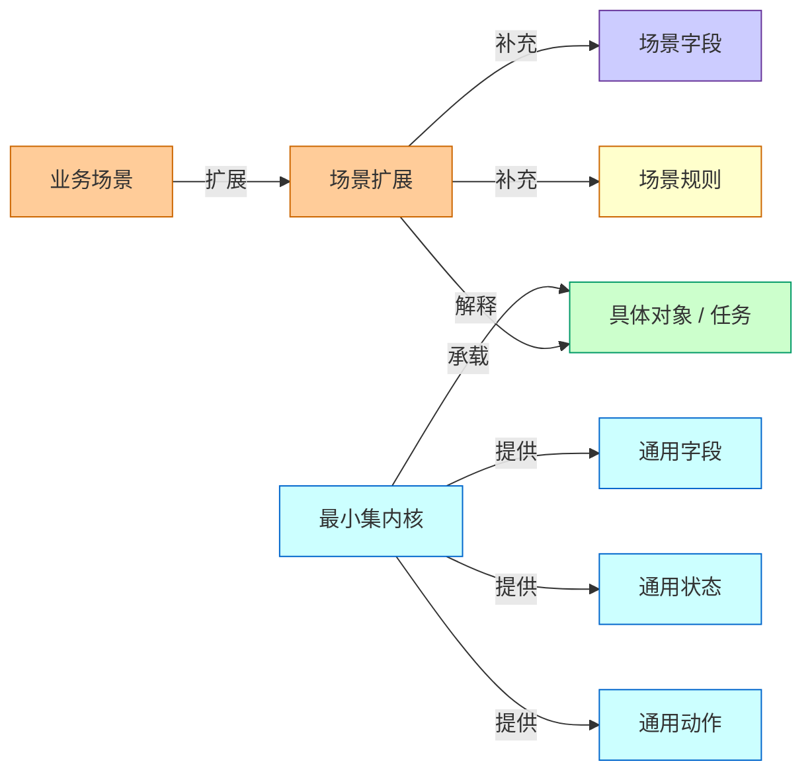
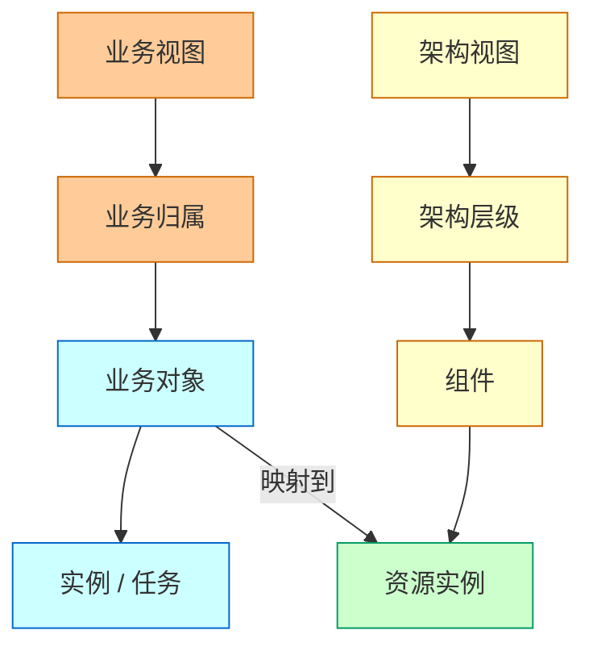
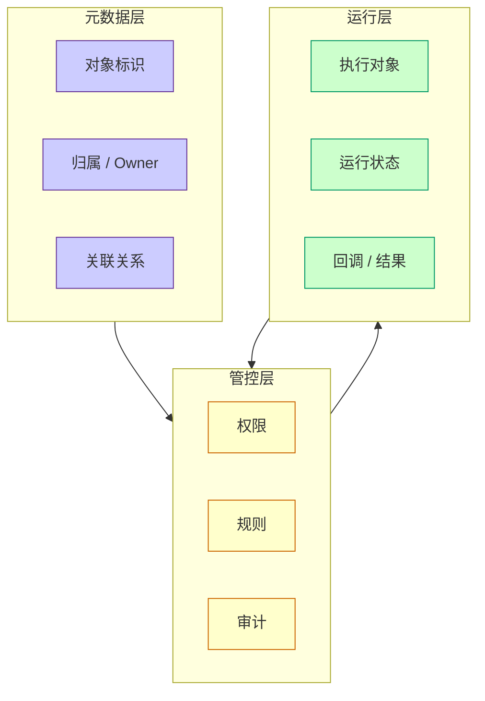
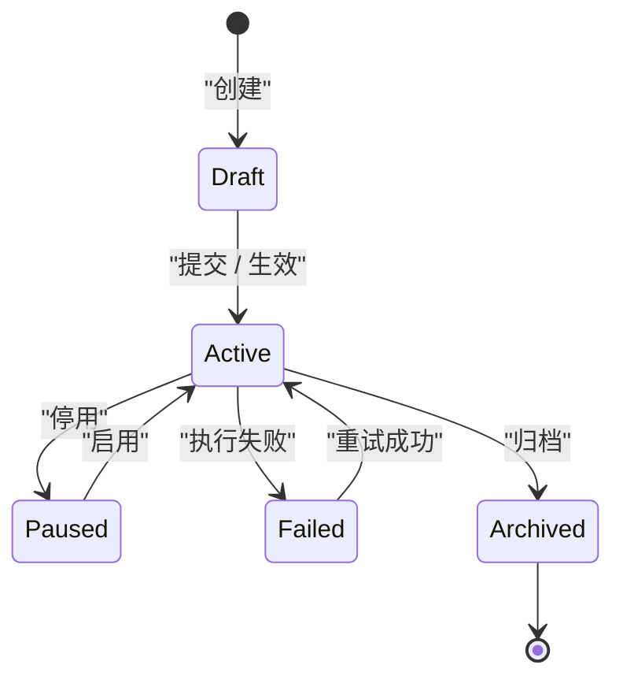
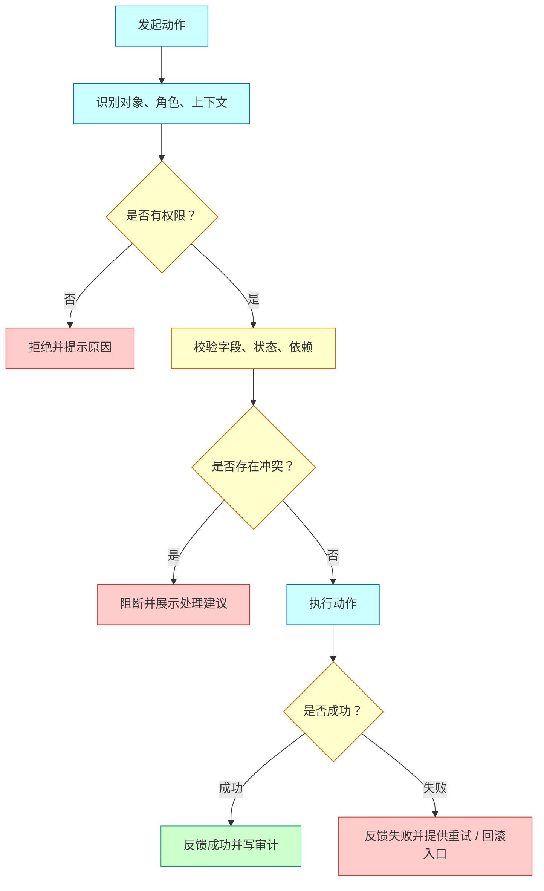

# Platform Modeling Patterns

Use these patterns for complex platform or multi-system PRDs. They are abstracted from the provided PRDs and "make a good product" methodology: define the problem, align with the user's thinking path, build a clear model, then make rules and interactions tangible.

All `graph`, `flowchart`, and `stateDiagram` examples in this file use web-safe Mermaid classes. Preserve this style when adapting the patterns.

## Pattern 1: Minimal Kernel And Scenario Extension

Use when a product needs to support multiple business scenarios without turning the core model into a pile of business-specific fields.

Core idea:

- Kernel owns stable nouns, common fields, common states, common actions, and common audit.
- Scenario extensions own scenario-only fields, rules, views, and workflow differences.
- A scenario can add to the kernel, but should not rewrite the kernel's meaning.

Model check:

| Question | Good Signal | Risk Signal |
| --- | --- | --- |
| What belongs in the kernel? | Used by most scenarios and stable over time | Added only for one urgent case |
| What belongs in extensions? | Scenario-only fields or rules | Business fields placed in common tables |
| How does a new scenario onboard? | Add extension metadata and mapping | Change the core model every time |

Diagram template:

## Pattern 2: Business View And Architecture View

Use when one set of resources must support different user mental models.

Core idea:

- Business users often start from business hierarchy, owner, settlement unit, model, service, or task.
- Platform and SRE users often start from resource hierarchy, architecture layer, cluster, component, host, or dependency.
- The product should clarify whether it owns one physical model and multiple views, or multiple models with mapping rules.

View table:

| View | User Question | Typical Nodes | Risk If Missing |
| --- | --- | --- | --- |
| Business view | Who owns this and what business does it affect? | BU, settlement unit, resource group, model, service | Responsibility is unclear |
| Architecture view | Where does it run and what does it depend on? | Layer, component, cluster, host, instance | Troubleshooting is slow |
| Governance view | What is risky, unaudited, or out of policy? | Rule, risk, audit, action | Platform cannot manage at scale |

Diagram template:

## Pattern 3: Metadata, Control, Runtime

Use when the product must distinguish management configuration from runtime execution.

Core idea:

- Metadata layer answers "what exists, who owns it, what it means".
- Control layer answers "what is allowed, what should happen, what is audited".
- Runtime layer answers "what is executing, what changed, what failed".

Layer table:

| Layer | Owns | Should Not Own |
| --- | --- | --- |
| Metadata | identity, ownership, attributes, relationships | high-frequency runtime state |
| Control | rules, permissions, approvals, policies, audits | raw execution details |
| Runtime | execution, status, measurements, callbacks | source-of-truth business ownership |

Diagram template:

## Pattern 4: Lifecycle And Operation Matrix

Use when actions depend on object state.

State machine template:

After the state machine, add an operation matrix:

| State | User Meaning | Allowed Actions | Blocked Actions | Audit |
| --- | --- | --- | --- | --- |
| Draft | Not effective yet | Edit, submit, delete | Runtime execution | yes |
| Active | Effective and in use | View, pause, change with confirmation | Unsafe direct deletion | yes |
| Failed | Action did not complete | View error, retry, rollback | Treat as effective | yes |
| Archived | No longer active | View history | Edit, execute | yes |

## Pattern 5: Deterministic Decision Flow

Use when the product must make a decision from rules, data, state, permissions, or dependencies.

Decision flow template:

Decision table:

| Decision Point | Input | Rule | Result | User Feedback |
| --- | --- | --- | --- | --- |
| Permission | role, object scope | user must have action permission | allow / block | show missing permission |
| Validation | fields, state | required, unique, type, range | allow / block | show field-level error |
| Conflict | related objects | no unresolved conflict | allow / block | show conflict source |
| Dependency | downstream system | dependency available or fallback exists | execute / retry / fail | show retry or owner |
