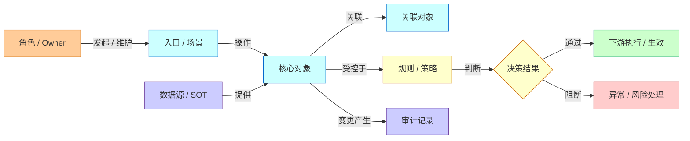
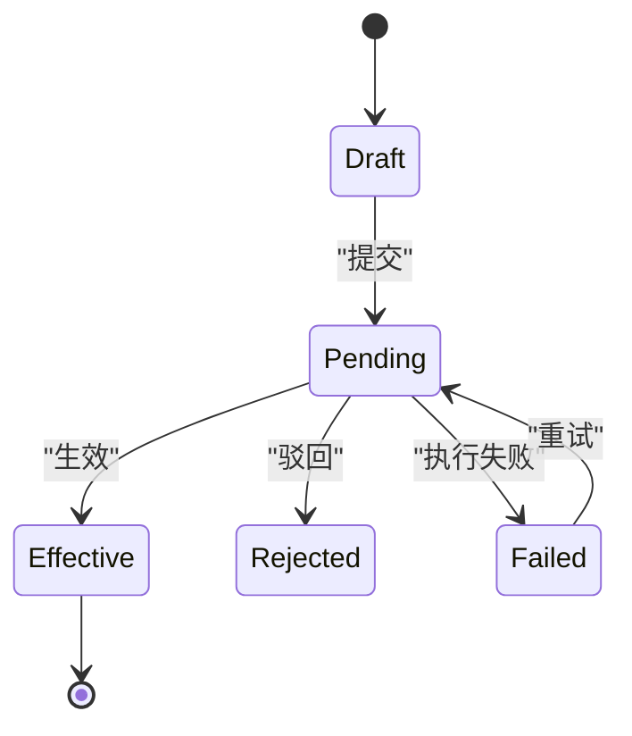
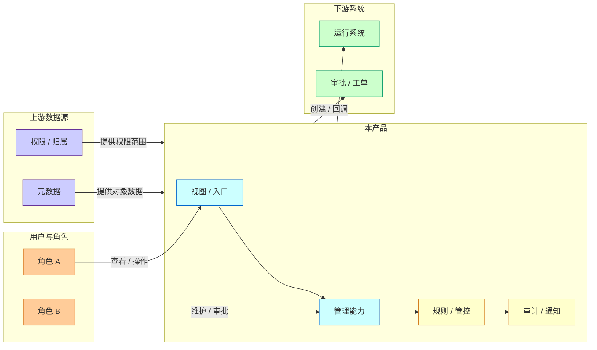
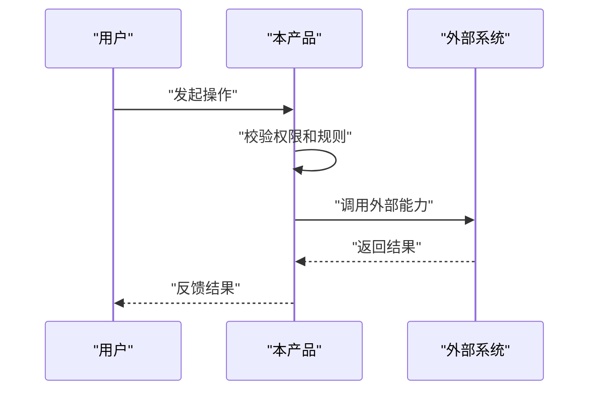

# PRD Template

Use this template for high-quality PRDs. Remove sections that are genuinely irrelevant, but do not skip problem, concept, model, rules, and acceptance thinking. If a section is not applicable, state why.

Expression rule: 能图不表，能表不文. Use concise Mermaid diagrams for relationships, flows, boundaries, states, and decisions; use tables for repeated attributes and rule rows; use prose for rationale and conclusions. Mermaid diagrams should be visually tidy. For `graph`, `flowchart`, and `stateDiagram`, include web-safe `classDef` and `class` statements.

Depth rule: a full PRD must not stop at background, goals, glossary, CRUD bullets, permissions, and phases. It must expose the implementation contract: domain model, decision rules, lifecycle, fields, operations, states, dependencies, exceptions, audit, and acceptance.

## 0. Document Information

| Field | Content |
| --- | --- |
| Title |  |
| Status | Draft / Review / Ready / Deprecated |
| Version |  |
| PM |  |
| Sponsor |  |
| Owner |  |
| RD / FE / QA / Design / Ops |  |
| Related docs |  |

## 1. Background And Problem Definition

### Background

Describe the business, system, operational, or incident context.

### Current Situation

Describe current process, current system, current workaround, and who is involved.

### Core Problems

| Problem | Root Cause | Impact | Evidence / Metric |
| --- | --- | --- | --- |
|  |  |  |  |

### Scope

This PRD solves:

- 

This PRD does not solve:

- 

## 2. Goals And Success Metrics

| Goal Type | Goal | Metric / Verification |
| --- | --- | --- |
| User |  |  |
| System |  |  |
| Business |  |  |
| Delivery |  |  |

## 3. Concepts And Glossary

| Concept | Definition | Example | Boundary / Distinction |
| --- | --- | --- | --- |
|  |  |  |  |

## 4. User Roles And Scenarios

| Role | Profile | Daily Behavior | Need | Risk / Concern | Corresponding Capability |
| --- | --- | --- | --- | --- | --- |
|  |  |  |  |  |  |

| Role | Scenario | I want to | So that | Function | Acceptance |
| --- | --- | --- | --- | --- | --- |
|  |  |  |  |  |  |

## 5. Product Positioning And System Boundary

### Positioning

Describe what this product/module is in the whole system.

### System Responsibilities

| System | Team | Responsibility | Change In This PRD |
| --- | --- | --- | --- |
|  |  |  |  |

### Boundary

This product owns:

- 

This product reuses:

- 

This product only references:

- 

## 6. Domain Model And Key Rules

### Concept Relationship Diagram

Explain the core nouns and relationships before listing fields. Keep the diagram focused on one question. It should usually contain 8-14 meaningful nodes and show actor, core object, related object, data source, rule/control point, audit, and exception where relevant.

### Entities

| Entity | Description | Unique ID | Owner | Source Of Truth |
| --- | --- | --- | --- | --- |
|  |  |  |  |  |

### Entity Fields

| Entity | Field | Meaning | Type | Required | Default | Validation | Notes |
| --- | --- | --- | --- | --- | --- | --- | --- |
|  |  |  |  |  |  |  |  |

### Relationships

| Source Entity | Relationship | Target Entity | Cardinality | Notes |
| --- | --- | --- | --- | --- |
|  |  |  |  |  |

### State Machine

| Current State | Action | Next State | Actor | Validation | User Feedback |
| --- | --- | --- | --- | --- | --- |
|  |  |  |  |  |  |

### Key Rules

- 

## 7. Product Solution Overview

### System Boundary / Layered Architecture

Use this diagram to show ownership and dependency boundaries, not every implementation detail.

### Information Architecture

Describe modules, navigation, and entry points.

### Core Flow

Describe the main user flow and system flow. Prefer a sequence diagram or flowchart over prose when order, branching, or responsibility matters.

### Solution Tradeoffs

| Solution | Description | Pros | Cons | Risks | Conclusion |
| --- | --- | --- | --- | --- | --- |
|  |  |  |  |  |  |

## 8. Detailed Module Design

Repeat this section for each module.

### Module: [Name]

#### Positioning

What this module solves and who uses it.

#### Entry

Where users enter from, and what context is carried.

#### Page / Layout

Describe major areas and information priority.

#### Data Display Contract

| Area | Field / Content | Source | Sort / Filter | Empty / Error Behavior | Permission |
| --- | --- | --- | --- | --- | --- |
|  |  |  |  |  |  |

#### Fields

| Field | Meaning | Type | Source | Required | Default | Validation | Permission / State | Notes |
| --- | --- | --- | --- | --- | --- | --- | --- | --- |
|  |  |  |  |  |  |  |  |  |

#### Operations

| Operation | Entry | Preconditions | Flow | Success Feedback | Failure Feedback | Audit | Permission |
| --- | --- | --- | --- | --- | --- | --- | --- |
|  |  |  |  |  |  |  |  |

#### Operation Rules

| Rule | Trigger | System Judgment | User Feedback | Audit / Notification |
| --- | --- | --- | --- | --- |
|  |  |  |  |  |

#### States And Exceptions

| State / Exception | Trigger | UI Behavior | System Behavior | Notes |
| --- | --- | --- | --- | --- |
| Empty |  |  |  |  |
| Loading |  |  |  |  |
| No permission |  |  |  |  |
| Validation failed |  |  |  |  |
| Dependency unavailable |  |  |  |  |

## 9. Permissions, Audit, Data, And Dependencies

### Permission Matrix

| Function | Role A | Role B | Role C | Notes |
| --- | --- | --- | --- | --- |
| View |  |  |  |  |
| Create |  |  |  |  |
| Edit |  |  |  |  |
| Delete |  |  |  |  |
| Approve |  |  |  |  |

### Audit

Audit must record:

- Actor
- Time
- Object
- Operation type
- Before value
- After value
- Reason
- Related ticket / task / rule

### Data And Interfaces

| Data / Interface | Provider | Consumer | Sync Method | Consistency Requirement | Fallback |
| --- | --- | --- | --- | --- | --- |
|  |  |  |  |  |  |

## 10. Milestones And Priority

### Priority

| Priority | Function | Reason | Dependency |
| --- | --- | --- | --- |
| P0 |  |  |  |
| P1 |  |  |  |
| P2 |  |  |  |

### Milestones

| Milestone | Product Goal | Scope | Dependency | Delivery Result |
| --- | --- | --- | --- | --- |
| M1 |  |  |  |  |
| M2 |  |  |  |  |
| M3 |  |  |  |  |

## 11. Risks, TODOs, And Open Questions

| Type | Item | Impact | Owner | Due Date | Status |
| --- | --- | --- | --- | --- | --- |
| Risk |  |  |  |  |  |
| TODO |  |  |  |  |  |
| Open question |  |  |  |  |  |

## 12. Acceptance Criteria

| Scenario | Preconditions | Operation | Expected Result | Verification |
| --- | --- | --- | --- | --- |
|  |  |  |  |  |
